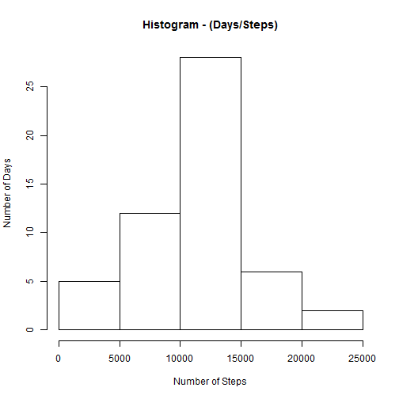
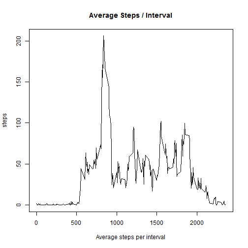

##### Loading required R Packages
  

```r
library("knitr")
library("markdown")
library("utils")
library("ggplot2")
library("stats")
```


##### Loading and preprocessing the data


```r
if(!exists("activity.csv")) {unzip("activity.zip")}
if(!exists("ActivityData")) {ActivityData<<-read.csv("activity.csv")}
ActivityData$date<-strptime(ActivityData$date, format = "%Y-%m-%d")
head(ActivityData)
```

```
##   steps       date interval
## 1    NA 2012-10-01        0
## 2    NA 2012-10-01        5
## 3    NA 2012-10-01       10
## 4    NA 2012-10-01       15
## 5    NA 2012-10-01       20
## 6    NA 2012-10-01       25
```

##### Histogram of the total number of steps taken each day.

```r
Daily<-aggregate(steps ~ as.character(date), data = ActivityData, FUN=sum, na.rm=TRUE)
hist(Daily$steps, xlab="Number of Steps", ylab="Number of Days", main= "Histogram - (Days/Steps)")
```

 

##### What is mean total number of steps taken per day?
##### What is median total number of steps taken per day?

```r
## Caluclates the mean total number of steps taken per day
StepsMean<-round(mean(Daily$steps))
## Caluclates the median number of steps taken per day
StepsMedian<-round(median(Daily$steps))
## Caluclates the Sample Standard Deviation of density of steps taken per day
StepsSD<-sd(Daily$steps)
```

##### As calculated  mean of steps  taken per day is 10766 and the median is 10765.

##### What is the average daily activity pattern?


```r
intDaily<-aggregate(steps ~  interval, data = ActivityData, FUN=mean, na.rm=TRUE)
plot(intDaily , type = "l", main="Average Steps / Interval", xlab="Average steps per interval")
```

 

```r
summary(intDaily)
```

```
##     interval          steps        
##  Min.   :   0.0   Min.   :  0.000  
##  1st Qu.: 588.8   1st Qu.:  2.486  
##  Median :1177.5   Median : 34.113  
##  Mean   :1177.5   Mean   : 37.383  
##  3rd Qu.:1766.2   3rd Qu.: 52.835  
##  Max.   :2355.0   Max.   :206.170
```


##### Imputing missing values


##### Are there differences in activity patterns between weekdays and weekends?
