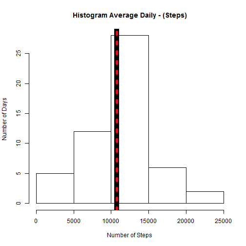
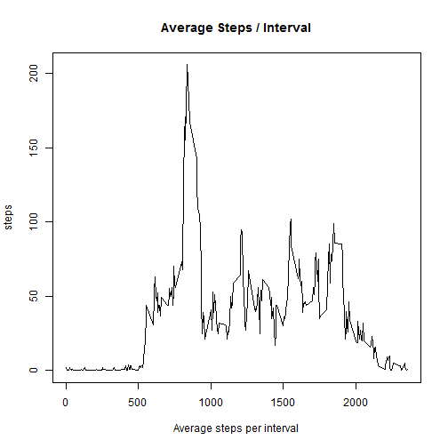
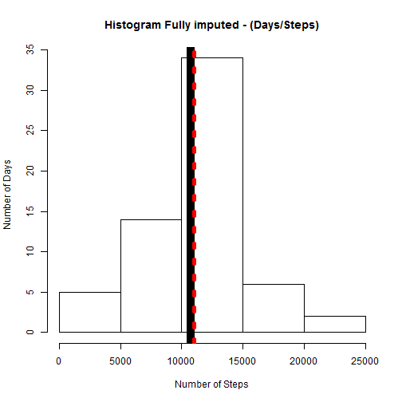
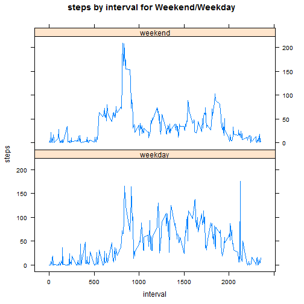

## Assignment 1


### Part 1 - Loading and preprocessing the data


1. Load the data (i.e. `read.csv()`)
  

```r
##### Loading and preprocessing the data
if(!exists("activity.csv")) {unzip("activity.zip")}
if(!exists("ActivityData")) {ActivityData<<-read.csv("activity.csv")}
```


2. Process/transform the data (if necessary) into a format suitable for your analysis

```r
## Processing and Transforming data.
## ActivityData$DateTime <-paste(ActivityData$date," ",(substr(as.character(ActivityData$interval+10000),2, 3)),":",(substr(as.character(ActivityData$interval+10000),4, 5)),sep = "")
## ActivityData$DateTime2<-strptime(ActivityData$DateTime,format = "%Y-%m-%d %H:%M")
## ActivityData$DOW<- format(ActivityData$DateTime2, "%A") # names of the day of week
## ActivityData$DOM<-format(ActivityData$DateTime2, "%d") # numerical day of month
## ActivityData$Hour<-format(ActivityData$DateTime2, "%H") # numerical Hour of day
## ActivityData$DateTime <-NULL
## ActivityData$Srank<-as.numeric(factor(ActivityData$steps))
## ActivityData$Irank<-as.numeric(factor(ActivityData$interval))
## ActivityData$x5<-(ActivityData$steps/5)
## ActivityData$activity<-c("NA")
## ActivityData$activity[(ActivityData$x5)==0]  <-c("Idle")
## ActivityData$activity[(ActivityData$x5)>0 & (ActivityData$x5)<50]  <-c("Moderate")
## ActivityData$activity[((ActivityData$x5)>=50) & ((ActivityData$x5)<100)]  <-c("walking")
## ActivityData$activity[((ActivityData$x5)>=100) & ((ActivityData$x5)<120)] <-c("Jogging")
## ActivityData$activity[((ActivityData$x5)>=120) & ((ActivityData$x5)<160)]  <-c("Running")
## ActivityData$activity[((ActivityData$x5)>=160) & ((ActivityData$x5)<220)]  <-c("Danger")
# lets search for a capitol in names weekdays
## w<-grepl("S", ActivityData$DOW)
## ActivityData$NDOW<-as.POSIXlt(ActivityData$date)$wda
# then insert "weekend" or "weekday" into a character vector.
## ActivityData$week[w]<-"weekend"
## ActivityData$week[!w]<-"weekday"
# then convert character vector to factor.
## ActivityData$week<-as.factor(ActivityData$week)
## ActivityData$Row<-row.names(ActivityData)
head(ActivityData)
```

```
##   steps       date interval
## 1    NA 2012-10-01        0
## 2    NA 2012-10-01        5
## 3    NA 2012-10-01       10
## 4    NA 2012-10-01       15
## 5    NA 2012-10-01       20
## 6    NA 2012-10-01       25
```


### Part 2 - What is mean total number of steps taken per day?

1. For this part of the assignment, I ignore the missing values in
the dataset and make a histogram of the total number of steps taken each day 
with a thick red vertical line representing the mean of steps taken  and a dashed green line representing the medeian value of steps taken.


```r
## This R code aggregates the sum of the total 
## steps taken per day and ignores NA's
DailyActivity<-aggregate(steps ~ as.character(date), data = ActivityData, FUN=sum, na.rm=TRUE)
## creates histogram using the base system.
hist(DailyActivity$steps, xlab="Number of Steps", ylab="Number of Days", main="Histogram Average Daily - (Steps)")
## Drows Mean and Median
abline(v=mean(DailyActivity$steps),col=1,lwd=10,lty=1 )
abline(v=median(DailyActivity$steps),col=2,lty=3, lwd=5)
```

 

```r
MDS<-round(mean(DailyActivity$steps),digits=0)
MDDS<-round(median(DailyActivity$steps),digits=0)

summary(DailyActivity)
```

```
##  as.character(date)     steps      
##  Length:53          Min.   :   41  
##  Class :character   1st Qu.: 8841  
##  Mode  :character   Median :10765  
##                     Mean   :10766  
##                     3rd Qu.:13294  
##                     Max.   :21194
```

2. The Calculated  **mean** of sum steps taken/day is `10766` and the **median** is `10765`.


```r
## The Mean Number of steps taken per day.
MeanDailySteps<-round(mean(DailyActivity$steps),digits=0)
## The Median Number of steps Taken per day
medianDailySteps<-round(median(DailyActivity$steps),digits=0)
```


.
### Part 3 - What is the average daily activity pattern?

1. Make a time series plot (i.e. `type = "l"`) of the 5-minute interval (x-axis) and the average number of steps taken, averaged across all days (y-axis)

```r
## Creates a time series plot
## creaes data table
intDaily<-aggregate(steps ~  interval, data = ActivityData, FUN=mean, na.rm=TRUE) ## creaes data table
intDaily$steps <- round(intDaily$steps, digits = 0)
## creates a plot
plot(intDaily , type = "l", main="Average Steps / Interval", xlab="Average steps per interval")
```

 

2. Which 5-minute interval, on average across all the days in the dataset, contains the maximum number of steps?

```r
## Calculates Maximum number os steps in any interval
MaxStepInterval<-intDaily[which.max(intDaily$steps),] ## to index the row containing first maximum of steps
MaxStepInterval
```

```
##     interval steps
## 104      835   206
```


##### Imputing missing values

1. Calculate and report the total number of missing values in the dataset (i.e. the total number of rows with `NA`s)

```r
### Calculating NA 
LengthNA<-length(which(is.na(ActivityData$steps)==TRUE))
LengthNA
```

```
## [1] 2304
```

2. Devise a strategy for filling in all of the missing values in the dataset. The strategy does not need to be sophisticated. For example, you could use the mean/median for that day, or the mean for that 5-minute interval, etc.

I struggled with this part of the assignment for several days. I tried repeatedly to use Amelea II, A program / R-package specifically intended for use in imputing missing time series data, however I was not able to use it properly. Then I triedd to VIM, another package for imputing missing values with no good imputations. Finally, i elected to simply make an attempt to fit the sample data to a gamma distribution as outlined in by Eric Cai at (https://chemicalstatistician.wordpress.com/2013/09/22/exploratory-data-analysis-quantile-quantile-plots-for-new-yorks-ozone-pollution-data/). I did manage to get a line that seemed to fit well enough to generate some random values for the step data. However, I was not able to allocate sufficent time to resolve some of the issues regarding what part of the day would have more or fewer values for steps. For instance there are fewer steps in at night than in the day. As it is my estimations make no considerations for day vs night or day of week. However they are estimations that I can live with for the now. 


```r
## a col for imputed values
ImputeActivity<-ActivityData[which(is.na(ActivityData$steps)==TRUE),1:3]
TestActivity<-ActivityData[which(!is.na(ActivityData$steps)==TRUE),1:3]
## use rgamma() to generate new values for steps2.
steps = (ActivityData$steps) ## create a variable for steps
steps = steps[!is.na(steps)] ### remove missing values from "steps"
n = length(steps) ## find the number of non-missing values in "ozone"

mean.steps = mean(steps) # calculate mean, 
var.steps = var(steps)   #variance 
sd.steps = sd(steps)      #and standard deviation of "ozone"
ImputeActivity$steps <- round(rgamma(LengthNA, shape = mean.steps^2/var.steps, scale = var.steps/mean.steps),digits=0) 
```
3. Create a new dataset that is equal to the original dataset but with the missing data filled in.

```r
ActivityFull<-rbind(ImputeActivity,TestActivity)
```
4. Make a histogram of the total number of steps taken each day and Calculate and report the **mean** and **median** total number of steps taken per day. Do these values differ from the estimates from the first part of the assignment? What is the impact of imputing missing data on the estimates of the total daily number of steps?

```r
## Makes a Histogram of totoal number of steps taken each day

DailyFull<-aggregate(steps ~ as.character(date), data = ActivityFull, FUN=sum, na.rm=TRUE)
hist(DailyFull$steps, xlab="Number of Steps", ylab="Number of Days", main= "Histogram Fully imputed - (Days/Steps)")

abline(v=mean(DailyFull$steps),col=1,lwd=10,lty=1 )
abline(v=median(DailyFull$steps),col=2,lty=3, lwd=5)
```

 

```r
summary(DailyFull)
```

```
##  as.character(date)     steps      
##  Length:61          Min.   :   41  
##  Class :character   1st Qu.: 8821  
##  Mode  :character   Median :10765  
##                     Mean   :10765  
##                     3rd Qu.:12883  
##                     Max.   :21194
```


##### Are there differences in activity patterns between weekdays and weekends?

For this part the `weekdays()` function may be of some help here. Use
the dataset with the filled-in missing values for this part.

1. Create a new factor variable in the dataset with two levels -- "weekday" and "weekend" indicating whether a given date is a weekday or weekend day.

```r
# lets search for a capitol in names weekdays
ActivityFull$DateTime <-paste(ActivityFull$date," ",(substr(as.character(ActivityFull$interval+10000),2, 3)),":",(substr(as.character(ActivityFull$interval+10000),4, 5)),sep = "")
ActivityFull$DateTime2<-strptime(ActivityFull$DateTime,format = "%Y-%m-%d %H:%M")
ActivityFull$DOW<- format(ActivityFull$DateTime2, "%A") # names of the day of week

w<-grepl("S", ActivityFull$DOW)
# then insert "weekend" or "weekday" into a character vector.
ActivityFull$week[w]<-"weekend"
ActivityFull$week[!w]<-"weekday"
# then convert character vector to factor.
ActivityFull$week<-as.factor(ActivityFull$week)
ActivityFull$steps2<-ActivityFull$steps
ActivityFull$steps<-NULL
```
1. Make a panel plot containing a time series plot (i.e. `type = "l"`) of the 5-minute interval (x-axis) and the average number of steps taken, averaged across all weekday days or weekend days (y-axis). The plot should look something like the following, which was created using **simulated data**:

```r
library(lattice)


weekdayFull<-ActivityFull[w,]
weekdayFull<-aggregate(steps2 ~ interval,data = weekdayFull, FUN=mean, na.rm=TRUE)
weekdayFull$week<-"weekday"
weekendFull<-ActivityFull[!w,]
weekendFull<-aggregate(steps2 ~ interval,data = weekendFull, FUN=mean, na.rm=TRUE)
weekendFull$week<-"weekend"
weekly<-rbind(weekdayFull,weekendFull)
attach(weekly)
```

```
## The following objects are masked from weekly (pos = 3):
## 
##     interval, steps2, week
```

```r
week.f<-factor(weekly,levels=c(1,2),
   labels=c("Weekeday","weekend"))

xyplot(steps2 ~ interval |week, type = "l",layout=c(1,2),
    main="steps by interval for Weekend/Weekday", 
   ylab="steps", xlab="interval")
```

 


